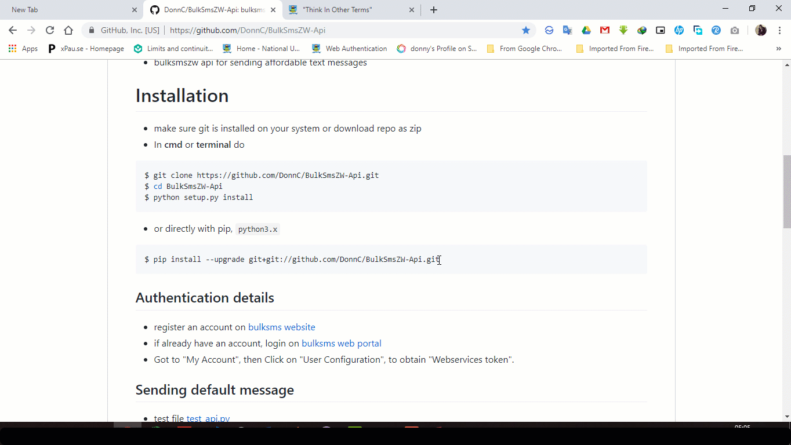
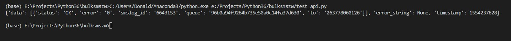
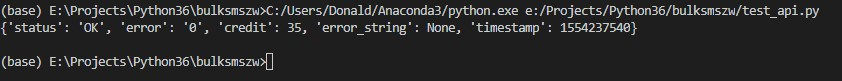
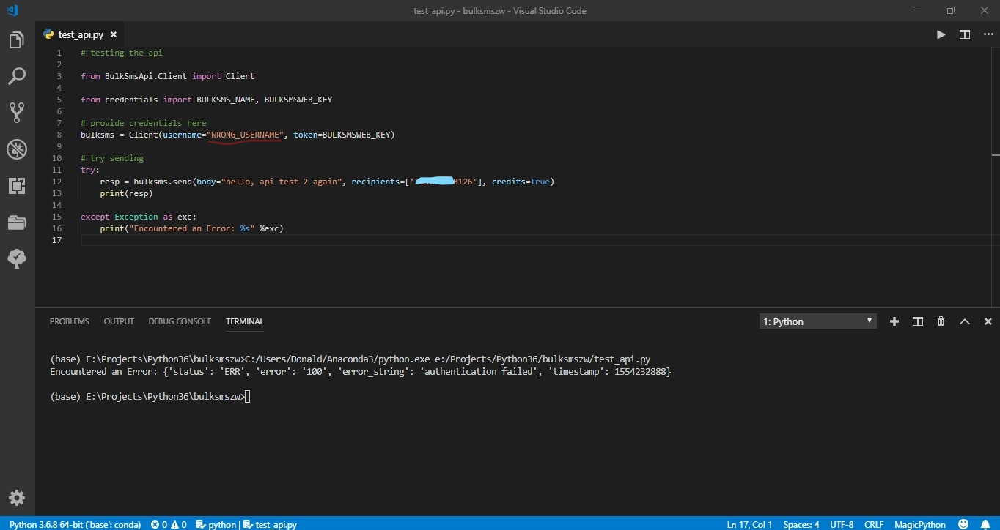

# [BulkSmsZW-Api](http://www.bulksmsweb.com/)
- bulksmszw api for sending affordable text messages in Python
- for Embedded device supported library in C++ for ESP8266-Arduino boards for IoT check out the ported library [bulksms ESP8266](https://github.com/DonnC/BulkSMSZW-ESP8266) 

# Installation
- make sure git is installed on your system or download repo as zip
- In **cmd** or **terminal** do

```bash
$ git clone https://github.com/DonnC/BulkSmsZW-Api.git
$ cd BulkSmsZW-Api
$ python setup.py install
```

- or directly with pip, ```python3.x``` 
```bash
$ pip install bulksmszw
```


## Authentication details
- register an account on [bulksms website](http://www.bulksmsweb.com/)
- if already have an account, login on [bulksms web portal](http://portal.bulksmsweb.com)
- Got to "My Account", then Click on "User Configuration", to obtain "Webservices token".

## Sending default message
- test file [test_api.py](test_api.py)
- recipients is passed as a list of bulksms valid format ```2637xxxxxxxx```, list can also contain groups ```#devteam``` and can be mixed

```python
 api = Client(<username>, <token>)
 respond = api.send("hello guys", ['2637xxxxxxxx', '#devteam', '#students'])
```

- Example script

```python
from BulkSmsApi.Client import Client

bulksms = Client(<username>, <web-token>)

response = bulksms.send(body="bulk sms ZW api testing", recipients=['2637xxxxxxxx', '2637yyyyyyyy'])

print(response)
```
- On successful run, the response



## Send message and get credits(text messages) left
- ```credits``` flag by default is set to ```False```
- to receive the number of credits on your web portal, set the ```credit``` flag to ```True```

```python
api = Client(<username>, <token>)

credits_response = api.send(body="hello world", recipients=['2637xxxxxxxx'], credits=True)

print(credits_response)
```


## Catch BulkSmsZw status errors as python exceptions
- You can wrap your code in a ```try - except``` to catch unsuccessful and bulksms error messages as normal python exceptions
```python
# this wil throw an exception because of the wrong / not valid username

bulksms = Client(username=<wrong-username>, token=<web-token>)

try:
    response = bulksms.send(body="bulk sms ZW api testing", recipients=['2637xxxxxxxx', '2637yyyyyyyy'])
    print(response)

except Exception as exc:
    print("Encountered an Error: %s" %exc)
```


## Responses
- responses are in default **JSON** format used by BulkSMSZW service

## acknowledgements
- Big shoutout to the BulkSMS ZW team
- Original bulksms [python api script](http://portal.bulksmsweb.com/sample/samplepy.html)
- All credits to the Bulk SMS ZW Team

## HTTP API
- api docs [HTTP API INTEGRATION DOC](http://portal.bulksmsweb.com/downloads/BulkSMS-API.pdf)

## [TODO]()
- Schedule messages
- Validate phone numbers

## get in contact
- [twitter](https://twitter.com/@donix_22)
- [whatsapp](https://wa.me/263778060126?text=BulkSMSZW-Api%20%0AGitHub:%0Ahttps://github.com/DonnC/BulkSmsZW-Api)
- donychinhuru@gmail.com
